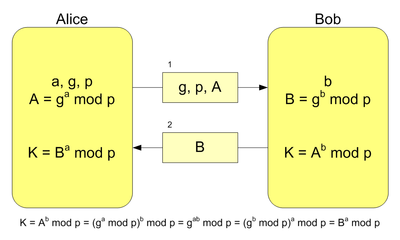

layout: true
.header[
Encryption building blocks
]

???
---

# Encryption

### Encryption building blocks


???
---

.left-column[
## Sources on Github
]

.right-column[
*Stefano Costa*, Bluewind R&D Managing Director

https://stefanoco.github.io/encryption-blocks
https://github.com/stefanoco

.pull-left[]
.pull-right[]

]

???
---

.left-column[
## People and links
]

.right-column[

Useful readings

http://www.cs.umd.edu/~jkatz/
http://www.cs.umd.edu/~jkatz/imc.html


]


???
---

.left-column[
## Executive summary
]

.right-column[
### Speed and ubiquity


Whitfield Diffie and Martin E. Hellman, *New directions in cryptography*
(IEEE Transactions on Information Technology 1976)
]


???
---

.left-column[
## Executive summary
]

.right-column[
### Building blocks for modern cryptography

* perfect secrecy
* one-time pad
* private key
* key exchange
* hashing functions
* secrecy and integrity
* asymmetric encryption
* digital signature schemes

]


???
---

.left-column[
## Perfect secrecy
]

.right-column[

### Definition

>Observing the ciphertext should have no effect
>on the adversary's knowledge regarding the actual message
>that was sent

>The a posteriori probability that some message was sent
>conditioned on the ciphertext that was observed
>should be no different from the a priori probability that
>the same message would be sent

>The ciphertext reveals nothing abouit the underlying plaintext

]

???
---

.left-column[
## Perfect secrecy
]

.right-column[

### Pre requisites

* the adversary knows the probability distribution of messages
* the adversary knows the encryption scheme
* the adversary can observe ciphertexts

]

???
---

.left-column[
## Perfect secrecy
]

.right-column[

### Randomness

* collect high-entropy data
* process and transform in a sequence of nearly independent and unbiased bit

]

???
---

.left-column[
## Perfect secrecy
]

.right-column[

### One-time pad (1917)

* the two parties agree on a random key
* the random key ha exactly the same length of the message to be sent
* encrypt: message XOR key
* decrypt: message XOR key

>The one-time pad is a perfectly secret encryption scheme

]

???
---

.left-column[
## Perfect secrecy
]

.right-column[

### One-time pad: pre requisites

* the key is as long as the message
* each message must use a different (randomly distributed) key

Nonetheless widely used by security agencies around 1950-1970.

]

???
---

.left-column[
## Private key
]

.right-column[

### Definition

* perfect secrecy vs computational security
* unlimited computational power vs bounded computational power
* not possible vs negligible probability
* random vs pseudorandom

]

???
---

.left-column[
## Private key
]

.right-column[

### Pseudorandom

>A pseudorandom generator is an efficient, deterministic algorithm
>for transforming a "short uniform string" (seed) into a
>"longer uniform-looking" (pseudorandom) output string.

* uniformity as a statistical property
* uniformity of pseudorandom generation is based on efficiency
* similar definition for pseudorandom functions

In other words: starting from a *short* seed (shared secret) both
honest parties can generate the same sequence of pseudorandom
*longer* strings, that appear as if they were uniform over
their domain.

]

???
---

.left-column[
## Private key
]

.right-column[

### One-time pad revisited

* the two parties agree on a random fixed-length key
* each party uses a pseudorandom generator to compute a derived key with length equal to message
* encrypt: message XOR (derived key)
* decrypt: message XOR (derived key)

>This fixed-length encryption scheme is secure under the assumption
>that we're using a true pseudorandom generator (this is a reduction)

Stream cipher is also possible

]

???
---

.left-column[
## Key exchange
]

.right-column[

### Definition       

Two parties agree on a *key* (a number, a secret) using an unsecure
communication channel without having shared anything previously.

Schemes exist for *key distribution* (Key Distribution Centres, KDC)
but this does not solve problems, or sometimes creates more vulnerable
parties (point of single failure). See *Kerberos* for widely used
solution.

]

???
---

.left-column[
## Key exchange
]

.right-column[
### The two padlocks


]

???
---

.left-column[
## Key exchange
]

.right-column[
### Colours mixing


]

???
---

.left-column[
## Key exchange
]

.right-column[
### Exponential and modulo functions: the final solution



Whitfield Diffie, Martin Hillmann, Ralph Merkle (1974-1976)

]

???
---

.left-column[
## Key exchange
]

.right-column[
### Diffie-Hillmann weakness

The proposed DH algorithm is robust against an *eavesdropping* adversary
in the sense that honest parties are assumed to be communicating
over a public but *authenticated* channel. Dropping this assumption
makes DH totally unsecure.

]

???
---

.left-column[
## Hashing functions
]

.right-column[

### Definition

A way to map a long input string to a shorter output string or *digest*.

h=H(x)

```bash
echo "The quick brown fox jumps over a lazy dog" | sha256sum -
33baf725b4d404ef7b01399848e37e8a0e8b3611bc0e96b2b4c46e8ebba9a7e5  -
```

]

???
---

.left-column[
## Hashing functions
]

.right-column[

### Properties

  * avoid collision
  * completely unpredictable: random oracle

]

???
---

.left-column[
## Hashing functions
]

.right-column[

### Uses

  * secrets storing
  * random generator
  * MAC and HMAC (Hash and MAC)
  * search key for collection
    * set of random data elements
    * few collisions
    * h=H(x)
  * encryption function
    * collision resistant
    * set of purposely forged data elements for generating a collision
    * h=H(s,x) where s: random with exclusions

]

???
---

.left-column[
## Attacks
]

.right-column[

### Attacks cathegories (very limited list)

  * timing attack
  * CPA: Chosen Plaintext Attach
    * secure algorithm using random functions and block cipher
  * CCA: Chosen Ciphertext Attach
    * subset: Padding Oracle Attach

]

???
---

.left-column[
## Secrecy and integrity
]

.right-column[

### Definition       

>The goal of cryptography is mainly to enable parties to communicate
>over an open communication channel in a secure way.

What does *secure* mean?

- secrecy: achieved with encryption
- integrity: achieved with authentication

]

???
---

.left-column[
## Secrecy and integrity
]

.right-column[

### Integrity and authentication

- authentication: who am I talking to?
- authentication: is the message authentic?

]

???
---

.left-column[
## Secrecy and integrity
]

.right-column[

### Examples

- cookies for online shops
  - the server is sender and receiver
- encryption does not prevent from mangling
  - bit flipping (stream cipher)
  - block erase (block cipher)

]

???
---

.left-column[
## Secrecy and integrity
]

.right-column[

### Solution

MAC (Message Authentication Code)

* generation algorithm
  * takes a key and a message
  * outputs a MAC
* verification algorithm
  * takes a key, a message and a MAC
  * outputs true/false

Conditions

* pre-shared secret (or can't assure partners identity)
* does not prevent replay attacks (add timestamp or sequence numbers for this)

]

???
---

.left-column[
## Secrecy and integrity
]

.right-column[

### Example: time attack

MAC (Message Authentication Code)

* the evil
  * fixes message and key
  * builds and submits a `N`-length MAC string with:
    * first `I-1` chars already passed
    * char `I` ranging 0-255
    * chars 'I+1`..`N` all zero
    * (`I`=0 at first iteration)
* the honest at each try
  * computes MAC over message
  * compares received MAC with computed MAC
  * only once, comparison fails at char number `I+1`

The comparison time is perhaps longer when comparison fails at `I+1`
and this gives an indication of the exact char for position `I`

]

???
---

.left-column[
## Secrecy and integrity
]

.right-column[

### Strong and too strong

* MAC

>the adversary can request a MAC for any message he whishes to generate;
>under this condition, the adversary can not forge a valid MAC
>for a message for which a MAC was not requested before

* Strong MAC

>in addition: the adversary can not forge a different MAC
>for a message for which a MAC was already been obtained


]

???
---

.left-column[
## Secrecy and integrity
]

.right-column[

### Combine MAC and encrypt

* encrypt and authenticate
  * obviously unsecure at all
* authenticate then encrypt
  * not always secure, depends on encryption scheme
  * example: CPA attack, problems with message pad in block ciphers
* encrypt then authenticate
  * the only secure using a Secure MAC

]

???
---

.left-column[
## Asymmetric encryption
]

.right-column[

### Exchanging a key

>How can parties share a secret key in the first place?

In a private key scenario, parties may have an option for sharing
a key over secure channel *but* with limits:

* time slot
* efficiency

]

???
---

.left-column[
## Asymmetric encryption
]

.right-column[

### Key-Distribution Centers (KDC)

* potential solution to sharing a secret between parties
* most venerable and widely used example: Kerberos
* three-parties scheme
* single point of failure (from secrecy point of view)

]

???
---

.left-column[
## Asymmetric encryption
]

.right-column[

### Key exchange algorithms

* potential solution to sharing a secret between parties
* famous achievement by Diffie and Hellman (and Merkle)
* the original scheme is insecure against man-in-the-middle
* the original scheme has been modified for robustness and adopted in TLS

]

???
---

.left-column[
## Asymmetric encryption
]

.right-column[

### Public-Key

* after key exchange, a new revolution is the idea of a Public-Keys scheme
* two domains: Private-Key and Public-Key

*Private-Key*

* secrecy: private-key encryption
* integrity: message authentication codes (MAC)

*Public-Key*

* secrecy: public-key encryption
* integrity: digital signature codes

]

???
---

.left-column[
## Asymmetric encryption
]

.right-column[

### Public-Key: usage domains

* one-to-many vs one-to-one
* unsecure channel exposed to the wild, the need for keys exchange
* authentication
* 2 to 3 times slower than Private-Key

>assumption: the senders are able
>to obtain a legitimate copy of receiver's public key

]

???
---

.left-column[
## Digital signature
]

.right-column[

### Definition

Integrity in the Public-Key setting

>allows a signer who has established a public key to sign a message
>using his private key, so that anyone who got the public key can
>verify that the message was originated from the intended signer and
>was not modified in transit

>assumption: the receivers are able
>to obtain a legitimate copy of sender's public key

]

???
---

.left-column[
## Digital signature
]

.right-column[

### Digital signature algorithms

Initial simple proposal

* the signer decrypts the message with his private key and sends the ciphertext
* the receiver encrypts the ciphertext with the public key

>this proposal is highly unsecure

]

???
